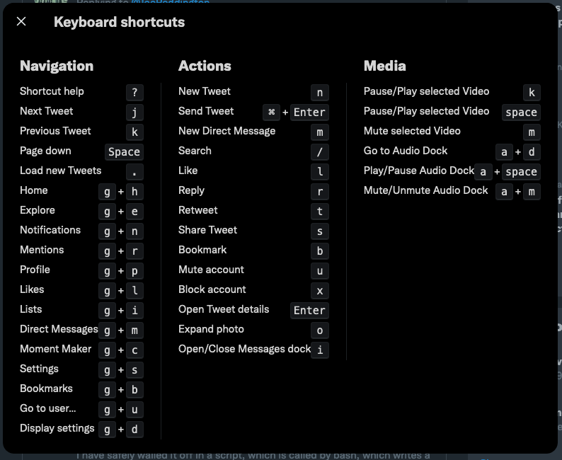
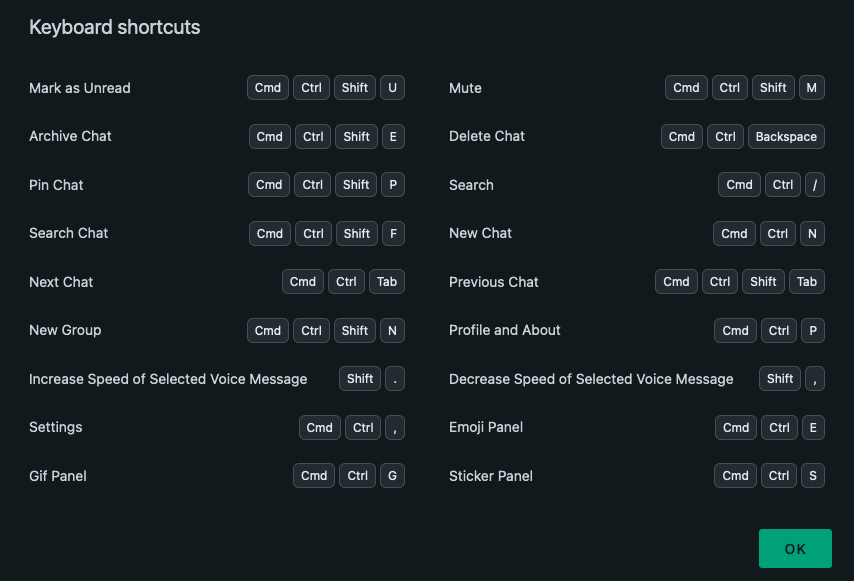
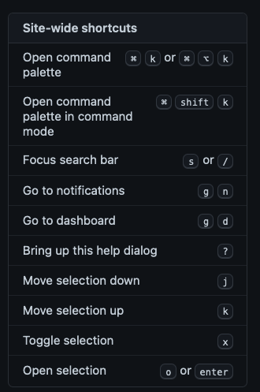
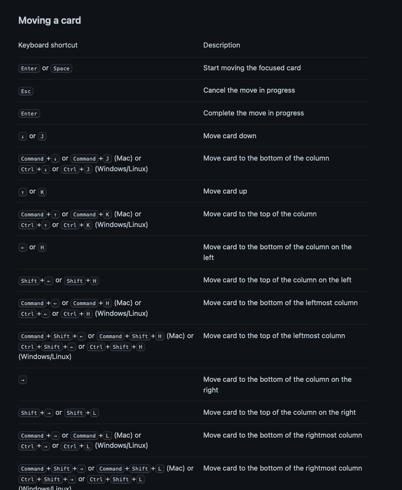
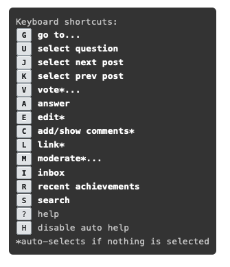
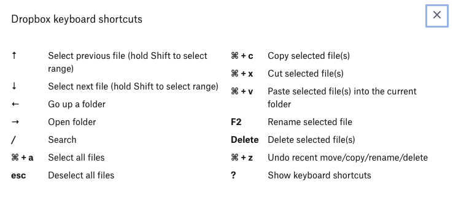

short=`

# Finder
Ctrl -F8 on big keyboard goes to system tray (and you can use the rectangle icon to see the window management ones 

# Tweetdeck 
Actions
    R Reply
    T Retweet
    F Like 
    N New Tweet
    D Direct Message
    P View user profile
    Return View Tweet details 
    Backspace Close Tweet details 
    Cmd ⌘ + Return Send Tweet 
    A Add column

Navigation
    ? This menu
    → Right
    ← Left
    ↓ Down
    ↑ Up
    1 … 9 Column 1－9
    0 Final column
    X Expand/Collapse navigation
    S Search

# Twitter 

# Firefox 
* Search shortcuts 
* '=' searches wolfram alpha
* '^' searches history
* @amazon @wikipedia do the obvious 

# Mouseless firefox extension 
* Copy url is Ctrl-Enter
* Open new tab is shift enter 

# Google Drive
* Upload file -shift-u
* Recent files: https://drive.google.com/drive/u/0/recent 
* Naivation view gn 
* items view: gl 

# Gmail 
';' expands the whole conversation

Compose and Chat
Shift + Esc :	Focus main window
Esc :	Focus latest chat or compose
Ctrl + . :	Advance to next chat or compose
Ctrl + , :	Advance to previous chat or compose
	
⌘ + Enter :	Send
	
⌘ + Shift + c :	Add Cc recipients
⌘ + Shift + b :	Add Bcc recipients
⌘ + Shift + f :	Access custom from
⌘ + Shift + d :	Discard draft
	
⌘ + k :	Insert a link
	
⌘ + ; :	Go to previous misspelled word
⌘ + ' :	Go to next misspelled word
⌘ + Shift + ' :	Open spelling suggestions
	Google Workspace side panel
⌘ + ⌥ + . :	Focus on side panel
⌘ + ⌥ + , :	Focus back to main window
	
	Formatting
	
⌘ + z :	Undo
⌘ + y :	Redo
	
⌘ + Shift + 5 :	Previous font
⌘ + Shift + 6 :	Next font
	
⌘ + Shift + - :	Decrease text size
⌘ + Shift + + :	Increase text size
	
⌘ + b :	Bold
⌘ + i :	Italics
⌘ + u :	Underline
	
⌘ + Shift + 7 :	Numbered list
⌘ + Shift + 8 :	Bulleted list
⌘ + Shift + 9 :	Quote
	
⌘ + [ :	Indent less
⌘ + ] :	Indent more
	
⌘ + Shift + l :	Align left
⌘ + Shift + e :	Align center
⌘ + Shift + r :	Align right
	
⌘ + Shift + , :	Set right-to-left
⌘ + Shift + . :	Set left-to-right
	
⌘ + Shift + x :	Strikethrough
	
⌘ + \ :	Remove formatting
The following keyboard shortcuts are currently enabled. Disable
	Jumping
g then i :	Go to Inbox
g then s :	Go to Starred conversations
g then b :	Go to Snoozed conversations
g then t :	Go to Sent messages
g then d :	Go to Drafts
g then a :	Go to All mail
g then c :	Go to Contacts
g then l :	Go to Label
g then k :	Go to Tasks
g then f :	Go to search filters
	Threadlist selection
* then a :	Select all conversations
* then n :	Deselect all conversations
* then r :	Select read conversations
* then u :	Select unread conversations
* then s :	Select starred conversations
* then t :	Select unstarred conversations
	Navigation
u :	Back to threadlist
k / j :	Newer/older conversation
o or Enter :	Open conversation; collapse/expand conversation
p / n :	Read previous/next message
g then n :	Go to next page
g then p :	Go to previous page

backtick :	Go to next inbox section
~ :	Go to previous inbox section
⌘ + ⌥ + v :	Reset sidebar sections to default height
/ :	Search mail
? :	Open keyboard shortcut help
q :	Search chat contacts
c :	Compose
d :	Compose in a tab
. :	Open "more actions" menu
v :	Open "move to" menu
l :	Open "label as" menu
	
, :	Move focus to toolbar
x :	Select conversation
s :	Toggle star/Rotate among superstars
y :	Remove label
e :	Archive
m :	Mute conversation
! :	Report as spam
r :	Reply
Shift + r :	Reply in a new window
a :	Reply all
Shift + a :	Reply all in a new window
f :	Forward
Shift + f :	Forward in a new window
Shift + n :	Update conversation
] / [ :	Remove conversation from current view and go newer/older
} / { :	Archive conversation and go newer/older
z :	Undo last action
; :	Expand entire conversation
: :	Collapse entire conversation

# Google Docs 
Ctrl-Alt-f is file menu
Option-/ is help, which you can search

# qbo
(quickbooks online)
[here's a link](https://quickbooks.intuit.com/learn-support/global/getting-started/keyboard-shortcuts-for-quickbooks-online/00/382346)

You can use: https://app.qbo.intuit.com/app/reconcile?accountId=29 to get to reconcile 

https://app.qbo.intuit.com/app/banking is for importing 
https://app.qbo.intuit.com/app/newfileupload is for importing 

The urls are actually quite well-formed 

# Zoom
Cmd-shift and A is mute
*  The shortcut keys for zoom https://support.zoom.us/hc/en-us/articles/205683899-hot-keys-and-keyboard-for-zoom 

# whatsapp 

# vim 
* /.{-}, means "shortest match of any characters until a ','" where as /.*, means "greedyly match until the last comma" 
* execute 'resize' line('$') "resizes to height of file. 
* :q is the command line history
* :argadd ands files to the argument list for :argdo 
* :Vex for File browser https://shapeshed.com/vim-netrw/ 
* :copen for the quickfix window 
* In a vim terminal window Ctrol-W and the (captial) N enter terminal normal mode
* Ctrl-K and then '3S' gives a ³
* :let @a=system('pwd') is putting a command into a register 
* buffergator
  * d/D close the buffer 
  * A - widen the window to see paths

# sheets 
Switching sheets - alt and down or up arrow  
Ctrol-Space is select column
 * File menu 	Ctrl + Option + f
 * Edit menu 	Ctrl + Option + e
 * View menu 	Ctrl + Option + v
 * Insert menu 	Ctrl + Option + i
 * Format menu 	Ctrl + Option + o
 * Data menu 	Ctrl + Option + d
 * Tools menu 	Ctrl + Option + t
 * Open insert menu 	⌘ + Option + = (with cells selected)
 * Open delete menu 	⌘ + Option + - (with cells selected)
 * Common actions
 * Select column 	Ctrl + Space
 * Select row 	Shift + Space
 * Select all 	⌘ + a
 * ⌘ + Shift + Space
 * Undo 	⌘ + z
 * Redo 	⌘ + y
 * ⌘ + Shift + z
 * Fn + F4
 * Find 	⌘ + f
 * Find and replace 	⌘ + Shift + h
 * Fill range 	⌘ + Enter
 * Fill down 	⌘ + d
 * Fill right 	⌘ + r
 * Save
 * (every change is saved automatically in Drive) 	⌘ + s
 * Open 	⌘ + o
 * Print 	⌘ + p
 * Copy 	⌘ + c
 * Cut 	⌘ + x
 * Paste 	⌘ + v
 * Paste values only 	⌘ + Shift + v
 * Show common keyboard shortcuts 	⌘ + /
 * Insert new sheet 	Shift + Fn + F11
 * Compact controls 	Ctrl + Shift + f
 * Input tools on/off
 * (available in spreadsheets in non-Latin languages) 	⌘ + Shift + k
 * Select input tools 	⌘ + Option + Shift + k
 * Search the menus 	Option + /

 * Format cells
 * Bold 	⌘ + b
 * Underline 	⌘ + u
 * Italic 	⌘ + i
 * Strikethrough 	Option + Shift + 5
 * Center align 	⌘ + Shift + e
 * Left align 	⌘ + Shift + l
 * Right align 	⌘ + Shift + r
 * Apply top border 	Option + Shift + 1
 * Apply right border 	Option + Shift + 2
 * Apply bottom border 	Option + Shift + 3
 * Apply left border 	Option + Shift + 4
 * Remove borders 	Option + Shift + 6
 * Apply outer border 	
 * 
 * Option + Shift + 7
 * 
 * ⌘ + Shift + 7
 * Insert link 	⌘ + k
 * Insert time 	⌘ + Shift + ;
 * Insert date 	⌘ + ;
 * Insert date and time 	⌘ + Option + Shift + ;
 * Format as decimal 	Ctrl + Shift + 1
 * Format as time 	Ctrl + Shift + 2
 * Format as date 	Ctrl + Shift + 3
 * Format as currency 	Ctrl + Shift + 4
 * Format as percentage 	Ctrl + Shift + 5
 * Format as exponent 	Ctrl + Shift + 6
 * Clear formatting 	⌘ + \
 * 
 * Navigate spreadsheet
 * Move to beginning of row 	Fn + Left Arrow
 * Move to beginning of sheet 	⌘ + Fn + Left Arrow
 * Move to end of row 	Fn + Right Arrow
 * Move to end of sheet 	⌘ + Fn + Right Arrow
 * Scroll to active cell 	⌘ + Backspace
 * Move to next sheet 	Option + Down Arrow
 * Move to previous sheet 	Option + Up Arrow
 * Display list of sheets 	Option + Shift + k
 * Open hyperlink 	Option + Enter
 * Open Explore 	Option + Shift + x
 * Go to side panel 	⌘ + Option + .
 * ⌘ + Option + ,
 * Move focus out of spreadsheet 	Ctrl + ⌘ + Shift + m
 * Move to quicksum
 * (when a range of cells is selected) 	Option + Shift + q
 * Move focus to popup
 * (for links, bookmarks, and images) 	holding Ctrl + ⌘, press e then p
 * Open drop-down menu on filtered cell 	Ctrl + ⌘ + r
 * Open revision history 	⌘ + Option + Shift + h
 * Close drawing editor 	⌘ + Esc
 * Shift + Esc
 * 
 * Edit notes and comments
 * Insert/edit note 	Shift + F2
 * Insert/edit comment 	⌘ + Option + m
 * Open comment discussion thread 	⌘ + Option + Shift + a
 * Enter current comment 	holding Ctrl + ⌘, press e then c
 * Move to next comment 	holding Ctrl + ⌘, press n then c
 * Move to previous comment 	holding Ctrl + ⌘, press p then c
 * 
 * Use keyboard shortcuts on selected comments
 * Reply to current comment 	R
 * Move to next comment 	J
 * Move to previous comment 	K
 * Resolve current comment 	E
 * Exit current comment 	U
 * 
 * Open a menu
 * Form menu
 * (present when the spreadsheet is connected to a form) 	Ctrl + Option + m
 * Add-ons menu 	Ctrl + Option + n
 * Help menu 	Ctrl + Option + h
 * Accessibility menu
 * (present when screen reader support is enabled) 	Ctrl + Option + a
 * Sheet menu
 * (copy, delete, and other sheet actions) 	Option + Shift + s
 * Context menu 	
 * 
 * ⌘ + Shift + \
 * Shift + F10
 * 
 * Add or change rows and columns
 * Insert rows above 	
 * 
 * ⌘ + Option + = (with rows selected)
 * Ctrl + Option + i, then r
 * Insert rows below 	Ctrl + Option + i, then b
 * Insert columns to the left 	
 * 
 * ⌘ + Option + = (with columns selected)
 * Ctrl + Option + i, then c
 * Insert columns to the right 	Ctrl + Option + i, then o
 * Delete rows 	⌘ + Option + - (with rows selected)
 * Ctrl + Option + e, then d
 * Delete columns 	⌘ + Option + - (with columns selected)
 * Ctrl + Option + e, then e
 * Hide row 	⌘ + Option + 9
 * Unhide row 	⌘ + Shift + 9
 * Hide column 	⌘ + Option + 0
 * Unhide column 	⌘ + Shift + 0
 * Group rows or columns 	Option + Shift + Right Arrow
 * Ungroup rows or columns 	Option + Shift + Left Arrow
 * Expand grouped rows or columns 	Option + Shift + Down Arrow 
 * Collapse grouped rows or columns 	Option + Shift + Up Arrow 
 * 
 * Use formulas
 * Show all formulas 	Ctrl + ~
 * Insert array formula 	⌘ + Shift + Enter
 * Collapse an expanded array formula 	⌘ + e
 * Show/hide formula help
 * (when entering a formula) 	Shift + Fn + F1
 * Full/compact formula help
 * (when entering a formula) 	Fn + F1
 * Absolute/relative references
 * (when entering a formula) 	Fn + F4
 * Toggle formula result previews
 * (when entering a formula) 	F

# Reminders 

New Reminder Command-N

New List Shift-Command-N

Indent reminder Command-]

Outdent reminder Command-[

Show all subtasks Command-E

Hide all subtasks Shift-Command-E

Flag reminder Shift-Command-F

Show info Command-I

Hide or show sidebar Option-Command-S

Mark a reminder completed or incomplete Shift-Command-C

Show or hide completed reminders Shift-Command-H

Edit tags Shift-Command-T

Delete tag Delete

Set reminder as due today Command-T

Set reminder as due tomorrow Option-Command-T

Set all overdue reminders as due today Control-Command-T

Set reminder as due this weekend Command-K

Set reminder as due next week Option-Command-K

Go to Today Smart List Command-1

Go to Scheduled Smart List Command-2

Go to All Smart List Command-3

Go to Flagged Smart List Command-4

Go to Assigned to Me Smart List Command-5

Enter or exit full screen Control-Command-F

# Github 
(site wide) 

# public tasks
(site wide) 

# stack exchange 

# dropbox 
(site wide) 

# Todo 
* Save an image in a browser 
* This would be good: https://github.com/joereddington/Projects-Public/issues/30 
* Override the lack of highlighting in browser. 
* Find a place to learn all these things 
* Hey, you know what would be really cool? An app that dectected what page or app you were on and displayed the relevent shortcut keys
  * Could add it to mousesniper really... 
* Put the mouse sniper actions in here. 
* Follow a bunch of keyboard shortcut twitter people. 

`

