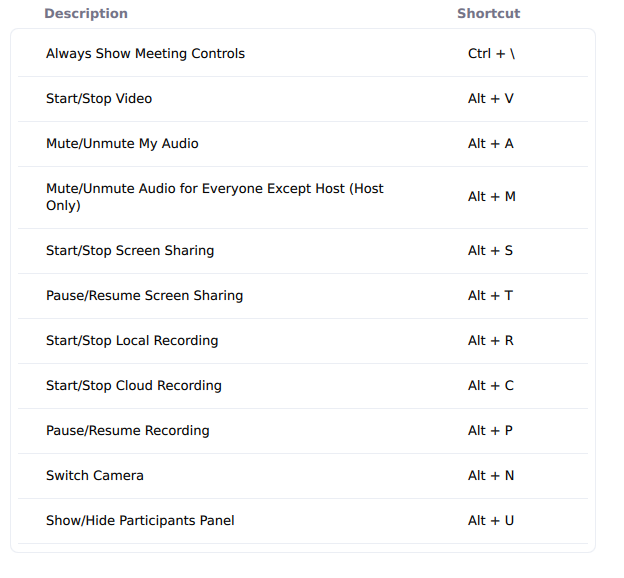
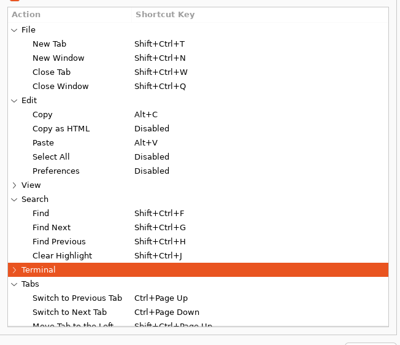
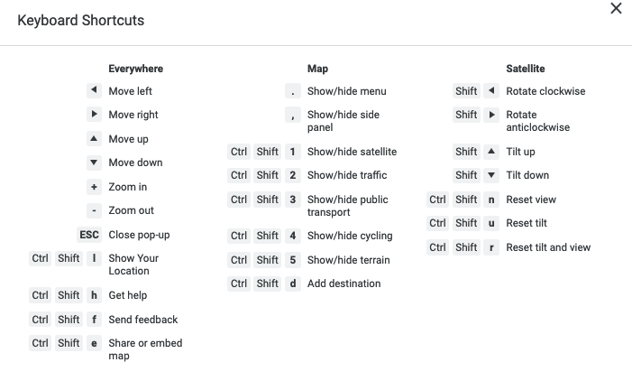
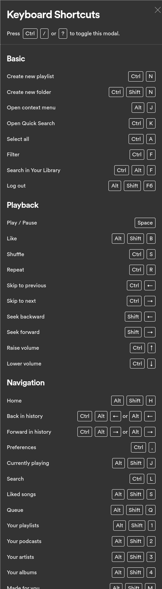
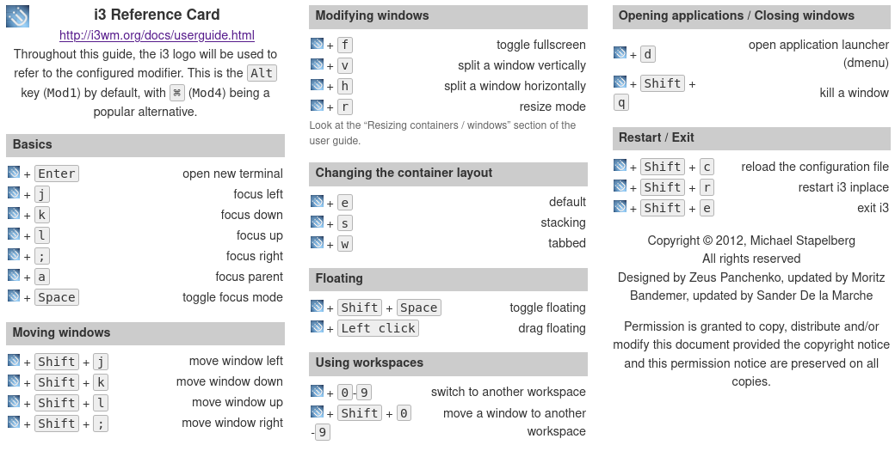

short=`

# Twitter 

# Firefox 
* Search shortcuts 
* '=' searches wolfram alpha
* '^' searches history
* @amazon @wikipedia do the obvious 
* ctrl-shirt-i - browser console 
* ctrl-shirt-j - other browser console 
* Mouseless firefox extension 
  * Copy url is Ctrl-Enter
  * Open new tab is shift enter 
* Containers 
  * Ctrl-shift-1 equality container 
  * Ctrl-shift-2 personal container 
  * Ctrl-shift-3  container 

# iterm
git reflog --date=local master  (from https://stackoverflow.com/a/12704702/170243) gives you the list of big actions taken on the repo

# Google Drive
* Upload file -shift-u
* Recent files: https://drive.google.com/drive/u/0/recent 
* Naivation view gn 
* items view: gl 

#  Google slides 
Search menu - ctrol and backtick 

# Gmail 
';' expands the whole conversation

Compose and Chat
Shift + Esc :	Focus main window
Esc :	Focus latest chat or compose
Ctrl + . :	Advance to next chat or compose
Ctrl + , :	Advance to previous chat or compose
	
The following keyboard shortcuts are currently enabled. Disable
	Jumping
g then i :	Go to Inbox
g then s :	Go to Starred conversations
g then b :	Go to Snoozed conversations
g then t :	Go to Sent messages
g then d :	Go to Drafts
g then a :	Go to All mail
g then c :	Go to Contacts
g then l :	Go to Label
g then k :	Go to Tasks
g then f :	Go to search filters
	Threadlist selection
* then a :	Select all conversations
* then n :	Deselect all conversations
* then r :	Select read conversations
* then u :	Select unread conversations
* then s :	Select starred conversations
* then t :	Select unstarred conversations
	Navigation
u :	Back to threadlist
k / j :	Newer/older conversation
o or Enter :	Open conversation; collapse/expand conversation
p / n :	Read previous/next message
g then n :	Go to next page
g then p :	Go to previous page

backtick :	Go to next inbox section
~ :	Go to previous inbox section
⌘ + ⌥ + v :	Reset sidebar sections to default height
/ :	Search mail
? :	Open keyboard shortcut help
q :	Search chat contacts
c :	Compose
d :	Compose in a tab
. :	Open "more actions" menu
v :	Open "move to" menu
l :	Open "label as" menu
	
, :	Move focus to toolbar
x :	Select conversation
s :	Toggle star/Rotate among superstars
y :	Remove label
e :	Archive
m :	Mute conversation
! :	Report as spam
r :	Reply
Shift + r :	Reply in a new window
a :	Reply all
Shift + a :	Reply all in a new window
f :	Forward
Shift + f :	Forward in a new window
Shift + n :	Update conversation
] / [ :	Remove conversation from current view and go newer/older
} / { :	Archive conversation and go newer/older
z :	Undo last action
; :	Expand entire conversation
: :	Collapse entire conversation

# Google Docs 
Ctrl-Alt-f is file menu
Option-/ is help, which you can search

# qbo
(quickbooks online)
[here's a link](https://quickbooks.intuit.com/learn-support/global/getting-started/keyboard-shortcuts-for-quickbooks-online/00/382346)

You can use: https://app.qbo.intuit.com/app/reconcile?accountId=29 to get to reconcile 

https://app.qbo.intuit.com/app/banking is for importing 
https://app.qbo.intuit.com/app/newfileupload is for importing 

The urls are actually quite well-formed 

# Zoom
Cmd-shift and A is mute
*  The shortcut keys for zoom https://support.zoom.us/hc/en-us/articles/205683899-hot-keys-and-keyboard-for-zoom 

# whatsapp 

# Preview 
* Cmd-9 - zoom to fit 

# vim 
* /.{-}, means "shortest match of any characters until a ','" where as /.*, means "greedyly match until the last comma" 
* execute 'resize' line('$') "resizes to height of file.
  * Actually 'resize 8' will make it 8 lines high which is enought 
* :q is the command line history
* :argadd ands files to the argument list for :argdo 
* :Vex for File browser https://shapeshed.com/vim-netrw/ 
* :copen for the quickfix window 
* In a vim terminal window Ctrol-W and the (captial) N enter terminal normal mode
* Ctrl-K and then '3S' gives a ³
* :let @a=system('pwd') is putting a command into a register 
* buffergator
  * d/D close the buffer 
  * A - widen the window to see paths
* :Git on its own opens an updating status window 

# joe-amd
* Ctrl-z then bg to add a late '&'

# sheets 
* Help menu 	alt-shift-h
* search help alt-/ 
* Select column 	Ctrl + Space

THESE ARE FOR OSX!
TODO - make this double column 
Switching sheets - alt and down or up arrow  
Ctrol-Space is select column
 * Select row 	Shift + Space
 * Select all 	⌘ + a
 * Find 	⌘ + f
 * Find and replace 	⌘ + Shift + h
 * Fill range 	⌘ + Enter
 * Fill down 	⌘ + d
 * Fill right 	⌘ + r
 * Open 	⌘ + o
 * Paste values only 	⌘ + Shift + v
 * Show common keyboard shortcuts 	⌘ + /
 * Insert new sheet 	Shift + Fn + F11
 * Compact controls 	Ctrl + Shift + f
 * Input tools on/off
 * (available in spreadsheets in non-Latin languages) 	⌘ + Shift + k
 * Select input tools 	⌘ + Option + Shift + k
 * Search the menus 	Option + /

# Reminders 

New Reminder Command-N

New List Shift-Command-N

Indent reminder Command-]

Outdent reminder Command-[

Show all subtasks Command-E

Hide all subtasks Shift-Command-E

Flag reminder Shift-Command-F

Show info Command-I

Hide or show sidebar Option-Command-S

Mark a reminder completed or incomplete Shift-Command-C

Show or hide completed reminders Shift-Command-H

Edit tags Shift-Command-T

Delete tag Delete

Set reminder as due today Command-T

Set reminder as due tomorrow Option-Command-T

Set all overdue reminders as due today Control-Command-T

Set reminder as due this weekend Command-K

Set reminder as due next week Option-Command-K

Go to Today Smart List Command-1

Go to Scheduled Smart List Command-2

Go to All Smart List Command-3

Go to Flagged Smart List Command-4

Go to Assigned to Me Smart List Command-5

Enter or exit full screen Control-Command-F

# Github 
(site wide) 

# public tasks
(site wide) 

# stack exchange 

# dropbox 
(site wide) 

# Maps 
(site wide) 

# Todo 
* Save an image in a browser 
* This would be good: https://github.com/joereddington/Projects-Public/issues/30 
* Override the lack of highlighting in browser. 
* Find a place to learn all these things 
* Hey, you know what would be really cool? An app that dectected what page or app you were on and displayed the relevent shortcut keys
  * Could add it to mousesniper really... 
* Put the mouse sniper actions in here. 
* Follow a bunch of keyboard shortcut twitter people. 

# Spotify 

# i3 

`

